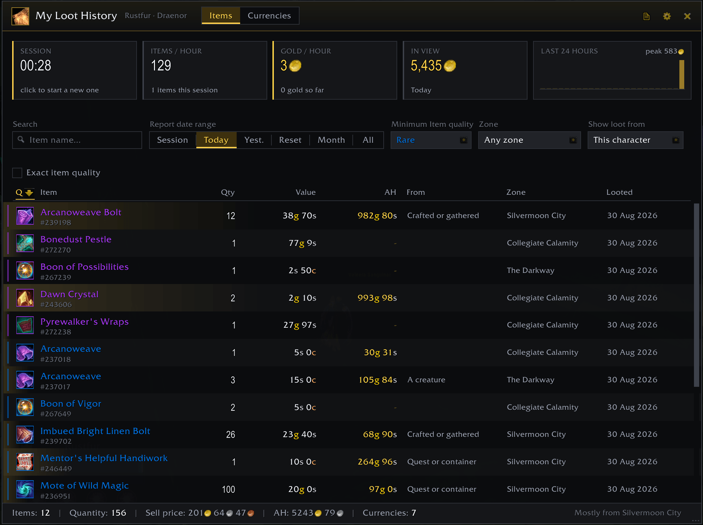
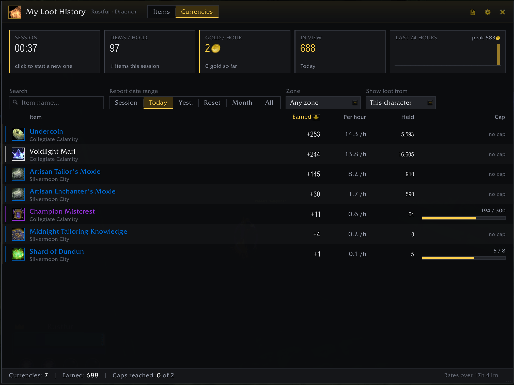
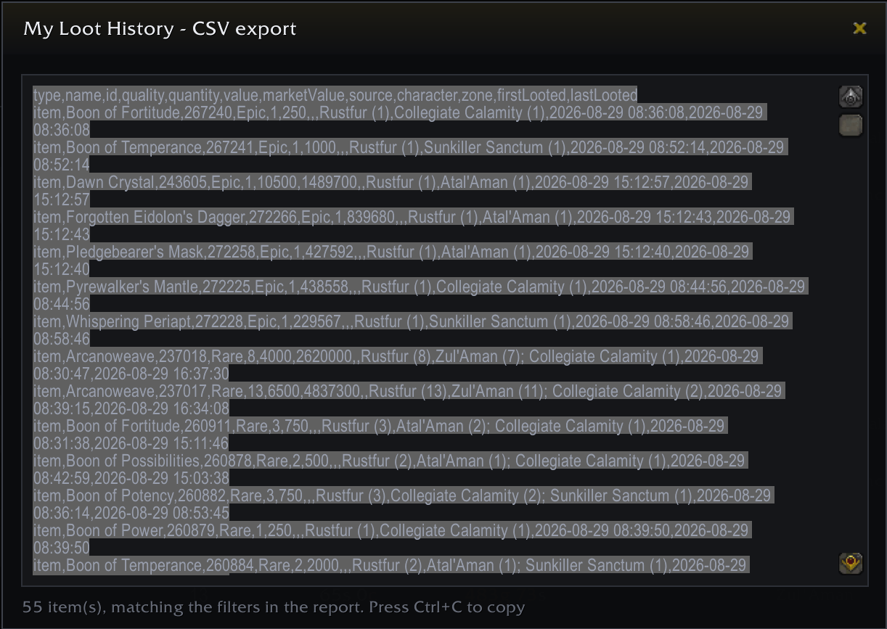
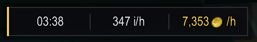

<div align="center">


<h1>My Loot History</h1>

[](https://www.curseforge.com/wow/addons/my-loot-history)

</div>

**Know exactly what your farming is worth.**

A World of Warcraft addon that tracks every item, coin and currency you loot — and turns it into a report you actually want to look at.

➡️ [Download on CurseForge](https://www.curseforge.com/wow/addons/my-loot-history) · 🌐 [Website](https://mlh.rustydaemon.com)



## Why you want it

- **Gold per hour, live.** See if this spot is still worth farming — without leaving the game.
- **Every drop, remembered.** Items, currencies and copper coins, with quantity, value, zone and date.
- **Know where things drop from.** The tooltip tells you which mob is actually paying for your farm.
- **Compare last night's farm to tonight's.** Sessions are saved, not thrown away.
- **All your characters in one view.** Or just this one. Your choice.

## The report

Type `/mlh` and you get one clean window:

- **Live stat cards** — time farmed, items/hour, gold/hour, and what you're looking at is worth
- **An hourly graph** — see _when_ you were earning, not just how much
- **A value bar on every row** — spot the three items paying for the whole session at a glance
- **A Currencies tab** — earned, per hour, what you're holding, and how close you are to the cap
- **Filters and sorting** — by character, date, session, zone, name or quality. Sort any column.
- **Export to CSV** — whatever you're looking at, exactly as you filtered it

It remembers its size and position, closes on Escape, and stays fast even with thousands of items.



_The Currencies tab._



_CSV export of exactly what you filtered._

## The session HUD

Three numbers on your screen, no window needed:



Drag it anywhere and lock it. Left click opens the report, right click starts a fresh session when you move to a new spot. Turn it on with `/mlh hud`.

## Tooltips everywhere

Hover any item — in your bags, at a vendor, in the auction house, in chat — and see how many you've looted before and when the last one dropped. No report needed.

## Prices

Vendor price by default. Install [Auctionator](https://www.curseforge.com/wow/addons/auctionator) and switch the price source to get an auction house column too — both side by side.

## Slash commands

| Command              | What it does                         |
| -------------------- | ------------------------------------ |
| `/mlh`               | Open the report                      |
| `/mlh config`        | Open settings                        |
| `/mlh session`       | Print time, items/hour and gold/hour |
| `/mlh session reset` | Start a new session now              |
| `/mlh hud`           | Show or hide the HUD                 |
| `/mlh hud lock`      | Lock the HUD in place                |

## Good to know

- Quest rewards are not tracked.
- Loot sources are recorded from the moment you install — older loot has no source to show.
- Items upgraded the instant you loot them (302 → 323 ilvl) are not tracked correctly yet.
- Nearly everything is optional: columns, tooltips, the minimap button, currency tracking, icon size and more live in `/mlh config`.

## For developers

Build a release with `tools/build.ps1` (Windows) or `tools/build.sh` (bash). Both validate the `.toc`, run luacheck and the tests, stage the addon into `dist/MyLootHistory` and zip it.

```bash
./tools/build.sh                 # or: powershell -NoProfile -ExecutionPolicy Bypass -File .\tools\build.ps1
./tools/build.sh --version 1.5.0 # rewrite the .toc version first
./tools/build.sh --clean         # wipe dist/ first
```

Run the tests alone with [busted](https://lunarmodules.github.io/busted/) (`luarocks install busted`):

```
busted
```

## License

GNU General Public License version 3. See the License file for details.
